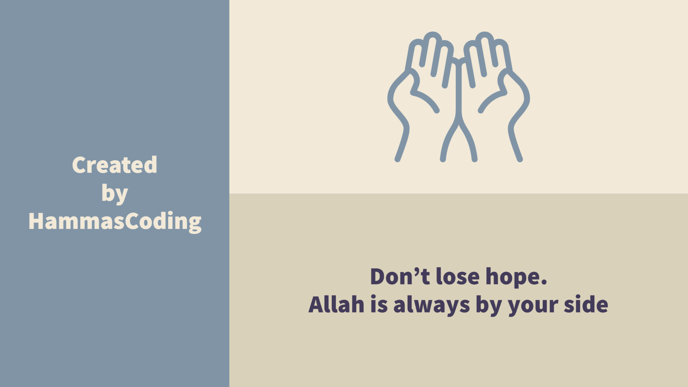

# 𝐇𝐞𝐥𝐥𝐨 World  

### **I'm Hammas Bin Saleem**
#### Full-stack Software Developer in the Making

- 🔭 I’m currently working on JavaScript Frameworks such as **React** 
- 🌱 I’m currently learning `HTML` `CSS` `JavaScript` 
- 👯 I’m looking to collaborate on JavaScript projects. 
- ⚡ Fun fact: I am Singer. 

## Find me around the web 🌎 :

  

  

# Github's Status

  

   

</h3>

Please feel free to clone/fork projects, raise issues and submit PRs if you think something could be better.
Ask me anything here
or email me 
http://hammassaleem376@gmail.com

⭐️ From [HAMMAS](https://github.com/HAMAS-SALEEM)

## Happy Coding! 😊

